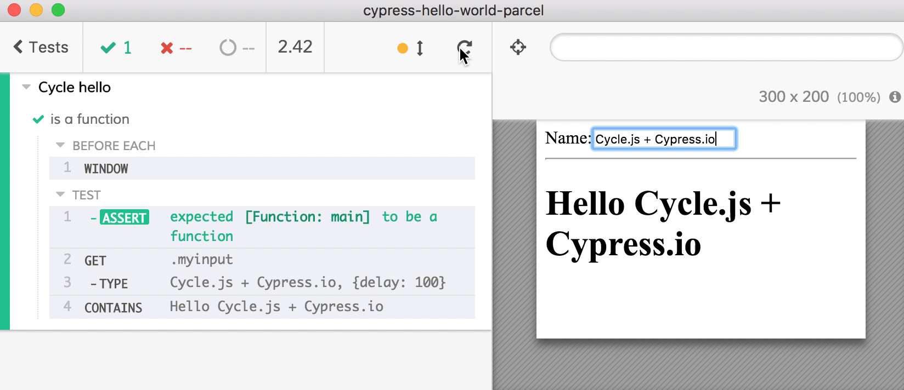

# cypress-cycle-unit-test

[](https://greenkeeper.io/)

> Unit testing Cycle.js components in Cypress E2E test runner

[![NPM][npm-icon] ][npm-url]

[![Build status][ci-image] ][ci-url]
[![semantic-release][semantic-image] ][semantic-url]
[![js-standard-style][standard-image]][standard-url]



## Install

Requires [Node](https://nodejs.org/en/) version 6 or above.

```sh
npm install --save-dev cypress cypress-cycle-unit-test
```

## Use

Mount your component's view function before each test.

```js
import {mount} from 'cypress-cycle-unit-test'
import {main} from './src/component'
beforeEach(() => {
  mount(main)
})
it('works', () => {
  // use full Cypress API to interact
  // and test the component
})
```

You can pass additional drivers (or even your own DOM driver)

```js
import { makeHTTPDriver } from '@cycle/http';
beforeEach(() => {
  mount(main, {
    HTTP: makeHTTPDriver()
  })
})
```

## Examples

- [Hello World](cypress/integration/hello-spec.js)
- [checkbox](cypress/integration/checkbox-spec.js)
- [counter](cypress/integration/counter-spec.js)
- [http-random-user](cypress/integration/http-random-user-spec.ts) shows TypeScript spec, HTTP spying and stubbing
- [many-spec.js](cypress/integration/many-spec.js) tests several components with props from [examples/many](examples/many) application

The source for the examples was taken from [https://github.com/cyclejs/cyclejs/tree/master/examples](https://github.com/cyclejs/cyclejs/tree/master/examples)

## Related projects

There are similar adapters for other frameworks

* [cypress-vue-unit-test](https://github.com/bahmutov/cypress-vue-unit-test)
* [cypress-react-unit-test](https://github.com/bahmutov/cypress-react-unit-test)
* [cypress-cycle-unit-test](https://github.com/bahmutov/cypress-cycle-unit-test)
* [cypress-svelte-unit-test](https://github.com/bahmutov/cypress-svelte-unit-test)
* [cypress-angular-unit-test](https://github.com/bahmutov/cypress-angular-unit-test)
* [cypress-hyperapp-unit-test](https://github.com/bahmutov/cypress-hyperapp-unit-test)
* [cypress-angularjs-unit-test](https://github.com/bahmutov/cypress-angularjs-unit-test)

### Small print

Author: Gleb Bahmutov &lt;gleb.bahmutov@gmail.com&gt; &copy; 2018

* [@bahmutov](https://twitter.com/bahmutov)
* [glebbahmutov.com](https://glebbahmutov.com)
* [blog](https://glebbahmutov.com/blog)

License: MIT - do anything with the code, but don't blame me if it does not work.

Support: if you find any problems with this module, email / tweet /
[open issue](https://github.com/bahmutov/cypress-cycle-unit-test/issues) on Github

## MIT License

Copyright (c) 2018 Gleb Bahmutov &lt;gleb.bahmutov@gmail.com&gt;

Permission is hereby granted, free of charge, to any person
obtaining a copy of this software and associated documentation
files (the "Software"), to deal in the Software without
restriction, including without limitation the rights to use,
copy, modify, merge, publish, distribute, sublicense, and/or sell
copies of the Software, and to permit persons to whom the
Software is furnished to do so, subject to the following
conditions:

The above copyright notice and this permission notice shall be
included in all copies or substantial portions of the Software.

THE SOFTWARE IS PROVIDED "AS IS", WITHOUT WARRANTY OF ANY KIND,
EXPRESS OR IMPLIED, INCLUDING BUT NOT LIMITED TO THE WARRANTIES
OF MERCHANTABILITY, FITNESS FOR A PARTICULAR PURPOSE AND
NONINFRINGEMENT. IN NO EVENT SHALL THE AUTHORS OR COPYRIGHT
HOLDERS BE LIABLE FOR ANY CLAIM, DAMAGES OR OTHER LIABILITY,
WHETHER IN AN ACTION OF CONTRACT, TORT OR OTHERWISE, ARISING
FROM, OUT OF OR IN CONNECTION WITH THE SOFTWARE OR THE USE OR
OTHER DEALINGS IN THE SOFTWARE.

[npm-icon]: https://nodei.co/npm/cypress-cycle-unit-test.svg?downloads=true
[npm-url]: https://npmjs.org/package/cypress-cycle-unit-test
[ci-image]: https://travis-ci.org/bahmutov/cypress-cycle-unit-test.svg?branch=master
[ci-url]: https://travis-ci.org/bahmutov/cypress-cycle-unit-test
[semantic-image]: https://img.shields.io/badge/%20%20%F0%9F%93%A6%F0%9F%9A%80-semantic--release-e10079.svg
[semantic-url]: https://github.com/semantic-release/semantic-release
[standard-image]: https://img.shields.io/badge/code%20style-standard-brightgreen.svg
[standard-url]: http://standardjs.com/
